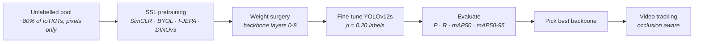
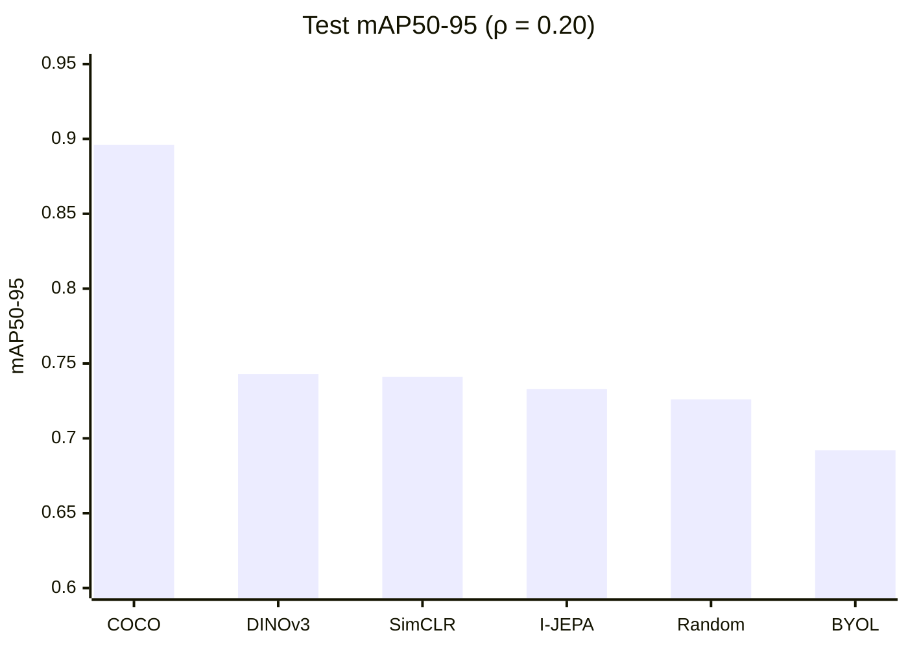
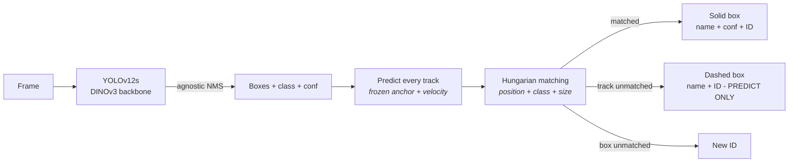

<div align="center">

# IoTKITs SSL Detection & Tracking

**Pretrain a YOLOv12s backbone without labels. Fine-tune it with 20% of the labels. Track IoT boards through occlusion.**

[](https://www.python.org/)
[](https://pytorch.org/)
[](https://docs.ultralytics.com/)
[](https://docs.ultralytics.com/models/yolo12/)
[](https://www.kaggle.com/mrpaul0007/code)
[](LICENSE)

SimCLR · BYOL · I-JEPA · DINOv3 · ByteTrack + occlusion-aware identity manager

</div>

---

> ### 🎓 New here? Start with the notebooks.
>
> You do **not** need a GPU or a local install. Every notebook runs in your browser on a free
> Kaggle **GPU T4** runtime.
>
> **1.** Open [NB-0 Partition](https://www.kaggle.com/code/mrpaul0007/self-supervised-learning-nb-0-partition) →
> **2.** Click **Copy & Edit** →
> **3.** Set **Accelerator → GPU T4**, turn **Internet on**, and run all cells.
>
> Then follow the [recommended run order](#recommended-run-order).

---

## ▶ Tracking demo

<!--
  HOW TO ADD THE VIDEO:
  1. On GitHub, open README.md → click the pencil (Edit).
  2. Drag your .mp4 (under 100 MB) into the editor at this spot.
  3. GitHub uploads it and inserts a line like:
       https://github.com/user-attachments/assets/xxxxxxxx-xxxx-xxxx
  4. Delete the placeholder line below and keep that link on its own line.
-->

https://github.com/user-attachments/assets/REPLACE-WITH-YOUR-VIDEO-LINK

*DINOv3-initialised YOLOv12s + occlusion-aware identity manager. Solid box = visible board.
Dashed box `ID n - PREDICT ONLY` = board fully hidden behind another, drawn at its predicted
position. Every board leaves the crossing with the same ID and name it entered with.*

---

## Contents

**Getting started**
- [What this project does](#what-this-project-does)
- [Results at a glance](#results-at-a-glance)
- [Dataset](#dataset)

**Notebooks**
- [Kaggle notebooks](#kaggle-notebooks)
- [How to run a notebook on Kaggle](#how-to-run-a-notebook-on-kaggle)
- [Recommended run order](#recommended-run-order)
- [What each notebook does](#what-each-notebook-does)

**Reference**
- [SSL architectures](#ssl-architectures)
- [Detector choice (Part A)](#detector-choice-part-a)
- [`.yaml` vs `.pt` — what our experiment claims](#yaml-vs-pt--what-our-experiment-claims)

**Guides**
- [1 · Partition the data](#1--partition-the-data)
- [2 · Pretrain without labels](#2--pretrain-without-labels)
- [3 · Transfer into a detector](#3--transfer-into-a-detector)
- [4 · Evaluate on labelled data](#4--evaluate-on-labelled-data)
- [5 · Track a video](#5--track-a-video)
- [Occlusion-aware identity manager](#occlusion-aware-identity-manager)

**Doing it properly**
- [Experimental protocol](#experimental-protocol)
- [Bugs found and fixed](#bugs-found-and-fixed)
- [Limitations](#limitations)
- [Repository layout](#repository-layout)
- [Team](#team)
- [License and acknowledgements](#license-and-acknowledgements)

---

## What this project does

Labelling detection data is expensive. Unlabelled images are cheap. This project asks:

> **With only 20% of the labels, does self-supervised pretraining on the other 80% give a better
> detector than training from scratch — and does that detector track boards reliably in video?**



Built for **CSE445 Computer Vision — Assignment 2** on Kaggle T4 runtimes, following the
structure of the course's SSL Detection Lab.

**Three things this project is careful about:**

| | |
|---|---|
| 🔍 **No hidden label use** | SSL pretraining reads pool images only. Test and validation images are checked to be absent from the pool in every notebook (`PASS` × 5). |
| ⚖️ **Fair comparison** | Every SSL method uses the same architecture, label subset, seed, image size, batch and epochs. Random-init and COCO baselines are trained **once** and reused. |
| 📏 **Honest metric boundaries** | The video has no ground-truth identities, so tracking is reported with proxy metrics and manual inspection — never as MOTA/IDF1. |

---

## Results at a glance

YOLOv12s · ρ = 0.20 · seed 42 · 200 fine-tune epochs · **test split**

| Initialisation | mAP50-95 | Δ vs random |
|---|---:|---:|
| COCO-pretrained *(upper reference)* | **0.896** | +0.170 |
| 🥇 **DINOv3** | **0.743** | +0.017 |
| SimCLR | 0.741 | +0.015 |
| I-JEPA | 0.733 | +0.007 |
| Random init *(lower reference)* | 0.726 | — |
| BYOL | 0.692 | −0.034 |



**Tracking (DINOv3 detector, 4 boards, crossing in two rows):**

| Board | ID before crossing | ID after crossing | Name kept |
|---|:---:|:---:|:---:|
| Arduino-Due | 1 | **1** | ✅ |
| Jetson Nano | 2 | **2** | ✅ |
| Raspberry-Pi-Zero-WH | 3 | **3** | ✅ |
| Arduino Uno (Black) | 4 | **4** | ✅ |

> Three of four SSL methods beat random init, but the gaps (~0.01–0.02) are within single-seed
> noise. The honest reading: SSL on ~2.5k unlabelled images helps a little; COCO-scale
> supervised pretraining still helps far more.

---

## Dataset

**IoTKITs** — RGB photographs of IoT development boards with bounding boxes.
Source: [Mendeley Data · x5thzmkxhy/1](https://data.mendeley.com/datasets/x5thzmkxhy/1)

| | |
|---|---|
| Format | `.jpg` / `.jpeg`, converted to YOLO labels |
| Classes | Raspberry Pi family, Arduino family, ESP32, STM32, Jetson, TelosB, … |
| What makes it hard | Near-identical classes: Pi Zero / Zero-W / Zero-WH / Zero-2-W, Arduino Nano / Micro, Due / Mega |
| Video | None in the dataset — see [5 · Track a video](#5--track-a-video) |

---

## Kaggle notebooks

Every notebook is a **Kaggle notebook** by `mrpaul0007`, mirrored in this repository under
[`Assignment A/`](Assignment%20A/) and [`Assignment B/`](Assignment%20B/).

### How to run a notebook on Kaggle

1. Open the Kaggle link and click **Copy & Edit** (sign-in required).
2. Right sidebar → **Session options → Accelerator → GPU T4**.
3. Turn **Internet on** (needed for `pip install ultralytics` and YOLO configs).
4. **Add Input** → attach the notebooks listed in the *Needs* column below.
5. **Restart & Run All**.

> **Run pretraining before its detect partner.** A detect notebook reads the `*_backbone.pt`
> written by the matching pretrain notebook.
>
> **Edited a config value? Use Restart & Run All.** A quick save keeps the *old* outputs on
> screen, which looks like your change did nothing.

### Recommended run order

Notebooks 1–2, 3–4, 5–6 and 7–8 are **pretrain → detect pairs**. Notebook 9 needs all four detect
notebooks.

| # | Notebook | Needs | Run on Kaggle |
|---:|---|---|---|
| 0a | **Partition** — SSL pool / ρ=0.20 / val / test, leakage checks | IoTKITs | [Open](https://www.kaggle.com/code/mrpaul0007/self-supervised-learning-nb-0-partition) |
| 0b | **Baselines** — random-init and COCO-pretrained YOLOv12s | 0a | [Open](https://www.kaggle.com/code/mrpaul0007/self-supervised-learning-nb-0-baseline) |
| 1 | **SimCLR pretraining** — NT-Xent, t-SNE, nearest neighbours | 0a | [Open](https://www.kaggle.com/code/mrpaul0007/self-supervised-learning-nb-1-simclr-pretrain) |
| 2 | **SimCLR → YOLOv12s** — surgery, fine-tune, evaluate | 0a, 0b, 1 | [Open](https://www.kaggle.com/code/mrpaul0007/self-supervised-learning-nb-1-simclr-detect) |
| 3 | **BYOL pretraining** — online / EMA target, AMP | 0a | [Open](https://www.kaggle.com/code/mrpaul0007/self-supervised-learning-nb-2-byol-pretrain) |
| 4 | **BYOL → YOLOv12s** | 0a, 0b, 3 | [Open](https://www.kaggle.com/code/mrpaul0007/self-supervised-learning-nb-2-byol-detect) |
| 5 | **I-JEPA pretraining** — ViT masked-latent prediction + CNN distillation | 0a | [Open](https://www.kaggle.com/code/mrpaul0007/self-supervised-learning-nb-3-ijepa-pretrain) |
| 6 | **I-JEPA → YOLOv12s** | 0a, 0b, 5 | [Open](https://www.kaggle.com/code/mrpaul0007/self-supervised-learning-nb-3-ijepa-detect) |
| 7 | **DINOv3 pretraining** — domain-adaptive multi-crop + CNN distillation | 0a | [Open](https://www.kaggle.com/code/mrpaul0007/self-supervised-learning-nb-3-dinov3-pretrain) |
| 8 | **DINOv3 → YOLOv12s** | 0a, 0b, 7 | [Open](https://www.kaggle.com/code/mrpaul0007/self-supervised-learning-nb-4-dinov3-detect) |
| 9 | **Tracking** — re-score all four, export winner, track video | 0a, 2, 4, 6, 8, video | [Open](https://www.kaggle.com/code/mrpaul0007/self-supervised-learning-nb-5-tracking) |

<details>
<summary>Approximate T4 runtime</summary>

| Notebook | Time |
|---|---|
| SimCLR / BYOL pretraining (200 epochs) | ~3–4 h |
| I-JEPA pretraining (ViT 200 epochs + distillation 200 epochs) | ~6 h |
| DINOv3 pretraining (200 epochs + distillation 200 epochs) | ~6.3 h |
| Each detect notebook (200 epochs) | ~3–4 h |
| Tracking (20 s clip at 1920 px) | ~15–25 min |

</details>

### What each notebook does

<details>
<summary>Expand notebook-by-notebook detail</summary>

All pretrain notebooks share one cell layout, and all detect notebooks share another, so the
four methods are directly comparable.

```text
Pretrain:  Config → Subset verification → Model + loss → Augmentation / masking + dataset
           → Sanity-check demo → Train → Loss curve → t-SNE + top-5 nearest neighbours
           → Interpretation → (ViT methods: CNN distillation + collapse check) → Save backbone

Detect:    Config → Data YAML → Subset verification → Weight surgery → Fine-tune
           → Demo inference → Baselines (reused) → Evaluation (val + test)
           → Qualitative predictions → Save results CSV
```

- **Partition** builds the SSL pool, the ρ = 0.20 labelled subset, validation and test splits
  with seed 42, and asserts five disjointness checks.
- **Baselines** fine-tunes YOLOv12s from `yolo12s.yaml` (random) and `yolo12s.pt` (COCO) once;
  every detect notebook reuses `base_random/` and `base_coco/`.
- **SimCLR / BYOL pretraining** train the YOLOv12s backbone directly and save a flat
  `state_dict` that drops into the detector.
- **I-JEPA / DINOv3 pretraining** train a ViT, then distil its features into a fresh YOLOv12s
  backbone (cosine + variance + covariance loss) because the detector needs a CNN.
- **Detect notebooks** transplant the backbone, fine-tune, report P / R / mAP50 / mAP50-95 on val
  and test, and save `<method>_result.csv`.
- **Tracking** re-scores all four checkpoints at their training resolution, exports the winner,
  and runs detection + tracking on the video.

</details>

---

## SSL architectures

| Architecture | Type | Objective | Encoder | Start weights | Moving target |
|---|---|---|---|---|---|
| **SimCLR** | Contrastive | NT-Xent agreement between 2 augmented views | YOLOv12s backbone | Random | No |
| **BYOL** | Non-contrastive | Online predictor matches EMA target projection | YOLOv12s backbone | Random | EMA |
| **I-JEPA** | Predictive | Predict target-block latents from a context block | ViT → distilled into YOLOv12s | Random | EMA |
| **DINOv3** | Self-distillation | Multi-crop student/teacher with centering | ViT-S/16 → distilled into YOLOv12s | Released DINOv3 weights | EMA |

> The assignment allows **only DINOv3** to start from released pretrained weights
> (domain-adaptive continuation). SimCLR, BYOL and I-JEPA run their objective from random
> initialisation.

### Detector choice (Part A)

Part A trained detectors on **full labels** to choose the Part B architecture.

| Detector | Outcome |
|---|---|
| YOLOv10s | Strong; F1 in the YOLO range (0.94–0.98) |
| **YOLOv12s** | **Selected** for Part B |
| YOLOv26s | Strong; F1 in the YOLO range (0.94–0.98) |
| RF-DETR-Nano | F1 0.745 — high recall (0.91) but low precision (0.66): NMS-free queries fire duplicate boxes on look-alike classes |

### `.yaml` vs `.pt` — what our experiment claims

| File | Initialisation | Used for |
|---|---|---|
| `yolo12s.yaml` | Random | SSL pretraining and the random baseline — **strict label-free** claim |
| `yolo12s.pt` | COCO-supervised | COCO baseline only — never reported as label-free |

> **No `v` from YOLO11 onward.** `YOLO("yolo12s.yaml")` ✅ — `YOLO("yolov12s.yaml")` ❌ does not
> exist upstream.

---

## 1 · Partition the data

```python
SEED = 42
RHO  = 0.20
```

```text
Disjointness checks
  train  subset-of ssl_pool         0   PASS
  test   ∩ ssl_pool                 0   PASS
  val    ∩ ssl_pool                 0   PASS
  test   ∩ train                    0   PASS
  val    ∩ train                    0   PASS
```

The labelled subset is drawn **from inside** the SSL pool, so pretraining never sees a validation
or test image.

---

## 2 · Pretrain without labels

```python
METHOD    = "SimCLR"            # or BYOL / I-JEPA / DINOv3
BEST_YAML = "yolo12s.yaml"      # random init
IMGSZ_SSL = 224
BATCH     = 16
EPOCHS    = 200
```

```python
full = YOLO(BEST_YAML).model
n_bb = len(full.yaml["backbone"])                 # 9 backbone layers
backbone = nn.Sequential(*list(full.model[:n_bb]))
# ... train the SSL objective on backbone ...
torch.save(backbone.state_dict(), "simclr_backbone.pt")
```

<details>
<summary>Representation diagnostics produced by every pretrain notebook</summary>

- Loss curve
- Two augmented views (or context/target masks) of one image, shown **before** training
- t-SNE of validation embeddings
- Top-5 nearest-neighbour retrieval
- A written interpretation — e.g. BYOL's neighbours matched background and lighting rather than
  board type, which predicted its weak downstream score

</details>

<details>
<summary>Why I-JEPA and DINOv3 need a distillation phase</summary>

Both learn a **ViT**, but YOLOv12s needs a **CNN** backbone. A second phase freezes the ViT and
trains a fresh YOLOv12s backbone + projector to match its pooled features:

```text
loss = −cosine(cnn_feat, vit_feat) + 5 · variance_loss + 1 · covariance_loss
```

The variance/covariance terms stop the CNN collapsing to a constant output. A reload check then
confirms `missing: 0, unexpected: 0` against `yolo12s.yaml`.

</details>

### Outputs

```text
simclr_backbone.pt   byol_backbone.pt   ijepa_backbone.pt   dinov3_backbone.pt
*_loss_curve.png     *_tsne.png         *_retrieval_panel.png
```

---

## 3 · Transfer into a detector

```python
det = YOLO("yolo12s.yaml")
model_sd = det.model.state_dict()
ssl_sd = torch.load(SSL_CKPT, map_location="cpu")

loaded = {"model." + k: v for k, v in ssl_sd.items()
          if "model." + k in model_sd and model_sd["model." + k].shape == v.shape}
model_sd.update(loaded)
det.model.load_state_dict(model_sd)
```

Verified for all four methods:

```text
Tensors initialised from SSL   : 342 / 691
Shape-mismatch / unused        : 0
SSL-initialised layer indices  : [0, 1, 2, 3, 4, 5, 6, 7, 8]      ← backbone
Randomly-initialised layers    : [11, 14, 15, 17, 18, 20, 21]     ← neck + head
>>> backbone == SSL ckpt: True                                      ← checked at train start
```

Then ordinary Ultralytics fine-tuning:

```python
det.train(data=DATA_YAML, epochs=200, imgsz=640, batch=16,
          optimizer="auto", lr0=0.01, lrf=0.01, seed=42)
```

---

## 4 · Evaluate on labelled data

```python
r = YOLO(best_pt).val(data=DATA_YAML, split="test", imgsz=640,
                      conf=0.001, iou=0.70, batch=16)
print(r.box.mp, r.box.mr, r.box.map50, r.box.map)
```

> **Evaluate at the resolution you trained at.** Re-scoring the same checkpoints at
> `imgsz=1280, iou=0.45` dropped every method to mAP ≈ 0.07–0.10 and picked the wrong winner.
> At `imgsz=640, iou=0.70` the numbers match each detect notebook exactly.

| Output | Contents |
|---|---|
| `<method>_result.csv` | P, R, mAP50, mAP50-95 for SSL / random / COCO on test |
| `ssl_ranking_rho20.csv` | All four SSL methods ranked |
| `*_test_eval/` | PR curve, confusion matrix, predictions |

---

## 5 · Track a video

### The test video

IoTKITs has **no video**, so the clip was composited in Canva from **real dataset photographs**
(test/val images) — real pixels, not AI-generated.

| | |
|---|---|
| Resolution / FPS | 1920 × 1080 · 30 fps |
| Length used | 20 s (600 frames) |
| Content | 4 boards in two rows, crossing left ↔ right, one board fully passing behind another |
| Ground truth | None → proxy metrics |

> **Why not an AI-generated clip?** A first attempt with an AI video gave 20–40% confidence and
> 130+ track IDs for 10 boards: the rendering style was a domain shift from the studio photos
> the detector learned from. Real dataset pixels raised confidence to 80–95%.

<details>
<summary>Video design lessons</summary>

- Boards need to be large (~350 px at 1920 width). At ~250 px the details that separate look-alike
  classes disappear.
- Give every board its own speed — identical speeds keep boards clustered.
- Overlap two boards at a time. Stacking three or four tests clutter, not occlusion.

</details>

### Tracking settings

| Setting | Value | Why |
|---|---|---|
| `imgsz` | 1920 | Native video width; keeps small details |
| `conf` / `iou` | 0.30 / 0.45 | Video detection thresholds |
| `agnostic_nms` | `True` | One box per board even when two similar classes fire |
| `tracker` | `bytetrack.yaml` | Raw IDs are logged; final IDs come from the identity manager |
| `KEEP_LOST_FRAMES` | 200 | A hidden board is remembered for ~6.7 s |

### Outputs

```text
group-k_partB_tracked_h264.mp4   annotated video
tracks.csv                       frame, track_id, box, conf, class, tracker_raw_id
tracks_mot.txt                   MOT-format tracks
proxy_metrics.json               unique IDs, track length, fragmentation, FPS
video_doc.json                   source, trim, resolution, frame rate
```

> ### A plain video has no ground truth
>
> **Measurable here:** unique track IDs vs expected board count · track length ·
> fragmentation · detection confidence · inference and end-to-end FPS · manual ID-switch notes.
>
> **Not calculable:** MOTA · MOTP · IDF1 · HOTA — these need ground-truth identities per frame.

---

## Occlusion-aware identity manager

Plain ByteTrack kept giving hidden boards a new ID. We traced the failure to five causes and
replaced ByteTrack's ID decision with a small matcher on top of the detector.



| Symptom in the video | Root cause | Fix |
|---|---|---|
| Hidden board returns with a **new ID** | Memory (8 → 90 frames) shorter than the occlusion (~95 frames at ~2 px/frame) | `KEEP_LOST_FRAMES = 200` |
| Predicted box drifts the **wrong way** | While half-covered, the box shrinks from one side, so its centre moves opposite to the real motion | Update position/velocity **only from full-size boxes** (≥ 95%), freeze while occluded |
| **Two IDs on one board** | Model fires two similar classes (*Uno Black* / *Uno Camera Shield*); class-wise NMS keeps both | `agnostic_nms=True` |
| ByteTrack **swaps IDs** at the crossing | ByteTrack matches by box overlap; crossing boards overlap | Ignore ByteTrack IDs; Hungarian matching on our own cost |
| Top board takes the hidden board's ID | Both tracks predicted at the same spot → tie | Class penalty for confident mismatches + size tie-break |
| Name flickers during overlap | Partly visible boards get misclassified | Name = confidence-weighted vote over **full-view** frames only |

<details>
<summary>Matching cost</summary>

```python
def assign_cost(track, frame, det):
    px, py = predict_center(track, frame)          # anchor + velocity × gap
    # how far the box sticks out of the track's predicted full box
    # (a partly visible box lying inside it costs ~0)
    ox = max(0, abs(det.cx - px) - max(0, (track.full_w - det.w) / 2))
    oy = max(0, abs(det.cy - py) - max(0, (track.full_h - det.h) / 2))
    cost = ox + oy
    cost += SIZE_PENALTY * size_mismatch(det, track)            # 40
    if det.conf >= 0.6 and det.cls != track.locked_cls:
        cost += CLASS_PENALTY                                    # 120
    return cost                                                  # match if ≤ 150
```

| Parameter | Value |
|---|---|
| `FULL_RATIO` | 0.95 |
| `ASSIGN_GATE` | 150 px |
| `CLASS_PENALTY` | 120 |
| `SIZE_PENALTY` | 40 |
| `MIN_GHOST_LEN` | 15 full-view frames before a track may be drawn as PREDICT ONLY |

</details>

> The identity manager improves **association**, not **detection**. If the detector names a board
> wrongly in every full view, the locked name is consistently wrong. Detector accuracy (~0.74
> mAP50-95) remains the ceiling.

---

## Experimental protocol

| Setting | Value |
|---|---|
| Architecture | `yolo12s.yaml` |
| Label fraction ρ | 0.20 |
| Seed | 42 |
| SSL image size / batch / epochs | 224 / 16 / 200 |
| Fine-tune image size / batch / epochs | 640 / 16 / 200 |
| Optimizer, `lr0`, `lrf` | `auto`, 0.01, 0.01 |
| Eval `conf` / `iou` | 0.001 / 0.70 |
| Hardware | Kaggle T4 |

> **Epoch budget.** The assignment's standard fine-tune budget is 50 epochs; we used 200 because
> the T4 session allowed it, applied identically to every condition.

| # | Condition | Initialisation |
|---:|---|---|
| 1 | Baseline | Random YOLOv12s |
| 2 | Supervised transfer | COCO-pretrained YOLOv12s |
| 3 | Strict SSL | SimCLR / BYOL / I-JEPA from `yolo12s.yaml` |
| 4 | Warm-start SSL | DINOv3 from released weights, then domain adaptation |

---

## Bugs found and fixed

Kept on purpose — every one of these changed the results.

<details>
<summary>Expand the full list</summary>

| Bug | Symptom | Fix |
|---|---|---|
| Detect notebooks used `yolov10m.yaml` while SSL used YOLOv12s | Weight surgery "matched" by coincidence; SimCLR scored **below random** | `yolo12s.yaml` everywhere |
| Baselines retrained inside each detect notebook | Two conflicting sets of baseline numbers | Reuse `nb-0-baseline` |
| BYOL checkpoint keys prefixed `backbone.` | Did not load in weight surgery | Save `online_enc.state_dict()` (flat keys) |
| I-JEPA / DINOv3 produced ViT weights | Not loadable into a CNN detector | Added CNN distillation phase |
| DINOv3 pretrain missing `ultralytics` | `ModuleNotFoundError` at distillation | `pip install ultralytics timm` |
| Tracking re-scored checkpoints at `imgsz=1280, iou=0.45` | mAP ≈ 0.07–0.10, **wrong winner** | Re-score at `640 / 0.70` |
| BoT-SORT with generic person Re-ID | 2,000+ IDs | Dropped Re-ID |
| BoT-SORT yaml missing `model` key | `AttributeError` | `model: auto` |
| Occlusion handling | ID changes after every crossing | [Identity manager](#occlusion-aware-identity-manager) |

</details>

---

## Limitations

- **One seed, one ρ.** DINOv3 / SimCLR / I-JEPA differ by ~0.01 mAP — within run-to-run noise. Three
  seeds with mean ± std would be needed to claim a ranking.
- **Detection caps tracking.** Look-alike classes (Pi Zero family, Arduino Nano/Micro) are still
  confused at ~0.74 mAP50-95.
- **No tracking ground truth.** Proxy metrics and manual inspection only.
- **Constant-velocity assumption.** The identity manager suits smooth motion; sharp turns or camera
  shake would need a stronger motion model.
- **Composited video.** Real dataset pixels on a synthetic layout — real camera footage may behave
  differently.

---

## Repository layout

All training ran on **Kaggle**. This repository holds the exported notebooks; datasets,
checkpoints and videos live in each notebook's **Kaggle Output** tab.

```text
├── Assignment A/   Part A — YOLOv10s · YOLOv12s · YOLOv26s · RF-DETR-Nano, error analysis
├── Assignment B/   Part B — partition, baselines, 4 × (pretrain + detect), tracking
├── LICENSE         Apache-2.0
└── README.md
```

<details>
<summary>Where each output lives</summary>

| Output | Produced by |
|---|---|
| `yolo_rho20/`, `ssl_pool_images/` | Partition |
| `base_random/`, `base_coco/` | Baselines |
| `*_backbone.pt` | Pretrain notebooks |
| `*_rho20/weights/best.pt`, `*_result.csv` | Detect notebooks |
| Tracked video, `tracks.csv`, `tracks_mot.txt`, `ssl_ranking_rho20.csv`, `proxy_metrics.json` | Tracking |

To run from this repo: download a notebook → Kaggle **New Notebook → File → Import Notebook** →
attach its inputs → **Run All**.

</details>

---

## Team

**CSE445 Computer Vision · Assignment 2 · Group K · East West University**

| Name | ID |
|---|---|
| Ani Paul | 2022-3-60-321 |
| Srabusty Nasrin Sojja | 2022-3-60-309 |
| Khaled Mahmood Sifat | 2022-3-60-217 |

---

## License and acknowledgements

The notebooks in this repository are **Apache-2.0**. Dependencies and weights keep their own terms.

| Component | Terms |
|---|---|
| **Ultralytics** | AGPL-3.0 for open-source use, or an [Enterprise License](https://www.ultralytics.com/license) |
| **DINOv3** | Meta's [DINOv3 License](https://github.com/facebookresearch/dinov3/blob/main/LICENSE.md) |
| **IoTKITs** | Terms on the [Mendeley Data page](https://data.mendeley.com/datasets/x5thzmkxhy/1) |

- SimCLR — Chen et al., 2020 · BYOL — Grill et al., 2020 · I-JEPA — Assran et al., 2023 · DINOv3 — Meta AI
- Course instructor's [SSL Detection Lab](https://github.com/rifat963/ssl-detection-lab) — structure and workflow reference

<div align="center">

---

**[Tracking demo](#-tracking-demo) · [Kaggle notebooks](#kaggle-notebooks) · [Results](#results-at-a-glance) · [Identity manager](#occlusion-aware-identity-manager)**

</div>
