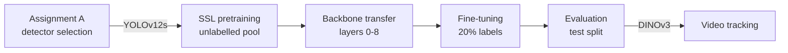
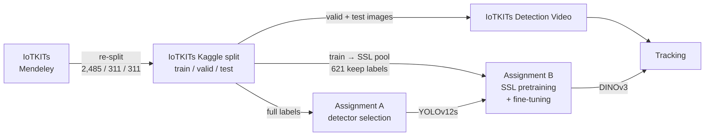
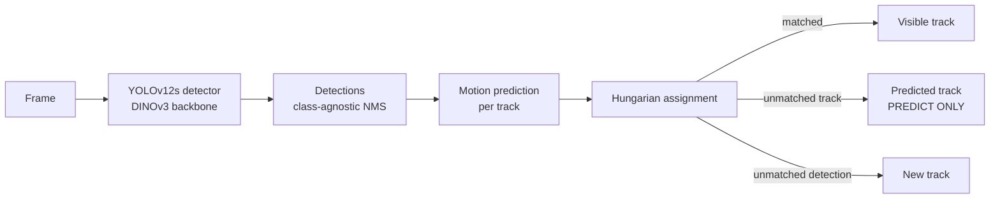

<div align="center">

# IoTKITs Object Detection and Tracking 
**Self-supervised pretraining for label-efficient detection of IoT development boards**

**CSE445 Computer Vision**

[](https://www.python.org/)
[](https://pytorch.org/)
[](https://docs.ultralytics.com/models/yolo12/)
[](https://www.kaggle.com/mrpaul0007/code)
[](LICENSE)

</div>

https://github.com/user-attachments/assets/24ab88d8-8e89-4f50-b802-73a7f0595341

<div align="center">

<sub>Tracking output of the selected detector (DINOv3-initialised YOLOv12s). Solid boxes are detected
boards; dashed boxes marked <code>PREDICT ONLY</code> are boards hidden behind another board, drawn at
their predicted position. Each board keeps its ID and class name through the occlusion.</sub>

</div>

---

## Overview

Bounding-box annotation is the most expensive part of building an object detector. This project
studies whether **self-supervised learning (SSL)** on unlabelled images can reduce that cost for
the [IoTKITs](https://data.mendeley.com/datasets/x5thzmkxhy/1) dataset.

The work is split into two assignments:

- **Assignment A: detector selection.** YOLOv10s, YOLOv12s, YOLOv26s and RF-DETR-Nano are trained
  on full labels and compared on accuracy, speed and error types. YOLOv12s is selected.
- **Assignment B: SSL pretraining and tracking.** The YOLOv12s backbone is pretrained with four
  SSL methods (SimCLR, BYOL, I-JEPA, DINOv3) on an unlabelled pool, transferred into a detector,
  and fine-tuned with only **20% of the labels**. Results are compared against random and
  COCO-pretrained initialisation. The best detector is then used to track boards through
  occlusion in a video.

Two datasets were created for this work: a **YOLO-format train/validation/test split of IoTKITs**,
used with full labels in Assignment A and re-partitioned into an unlabelled pool and a 20% labelled
subset in Assignment B, and an **IoTKITs detection video** built from real validation and test
images for the tracking experiment.



### Key results

| Aspect | Result |
|---|---|
| Datasets | IoTKITs (public) + 2 created: [YOLO split](https://www.kaggle.com/datasets/Mrpaul0007/iotkits), [detection video](https://www.kaggle.com/datasets/Mrpaul0007/iotkits-detection-video) |
| Selected detector (Assignment A) | YOLOv12s — mAP50-95 **0.946**, F1 **0.978**, 59.5 FPS |
| Best SSL backbone (Assignment B) | DINOv3 — mAP50-95 **0.743** with 20% labels |
| Gain over random initialisation | +0.017 (DINOv3), +0.015 (SimCLR), +0.007 (I-JEPA), −0.034 (BYOL) |
| Tracking | All four boards keep their ID and class name through full occlusion |

---

## Table of contents

1. [Datasets](#1-datasets)
2. [Notebooks](#2-notebooks)
3. [Assignment A: detector selection](#3-assignment-a-detector-selection)
4. [Assignment B: SSL pretraining](#4-assignment-b-ssl-pretraining)
5. [Video tracking](#5-video-tracking)
6. [Reproducing the results](#6-reproducing-the-results)
7. [Limitations](#7-limitations)
8. [Repository structure](#8-repository-structure)
9. [License and references](#10-license-and-references)

---

## 1. Datasets

One public dataset was used, and **two new datasets were created** from it.

| # | Dataset | Type | Built from | Used in | Link |
|---|---|---|---|---|---|
| 1 | IoTKITs | Public, original | — | Source for dataset 2 | [Mendeley Data](https://data.mendeley.com/datasets/x5thzmkxhy/1) |
| 2 | **IoTKITs (Split)** | **Created** | IoTKITs images and annotations | Assignment A; Assignment B | [Kaggle](https://www.kaggle.com/datasets/Mrpaul0007/iotkits) |
| 3 | **IoTKITs Detection Video** | **Created** | Validation and test images of dataset 2 | Tracking notebook | [Kaggle](https://www.kaggle.com/datasets/Mrpaul0007/iotkits-detection-video) |



### 1.1 IoTKITs (original dataset)

| Property | Value |
|---|---|
| Source | [Mendeley Data, x5thzmkxhy/1](https://data.mendeley.com/datasets/x5thzmkxhy/1) |
| Content | RGB photographs of IoT development boards with bounding-box annotations |
| Classes | Arduino (Due, Uno, Mega 2560, Nano, Micro, Pro Mini, Leonardo, Zero, shields), Raspberry Pi (1, 2, 3, 4, 5, Zero, Zero W, Zero WH, Zero 2 W), ESP32, ESP8266, Wemos, STM32, Jetson Nano, Jetson TX2, TelosB |
| Main difficulty | Several classes are visually near-identical and differ only by small printed text, an antenna or a header row |

### 1.2 IoTKITs YOLO split (created dataset)

**Kaggle:** [kaggle.com/datasets/Mrpaul0007/iotkits](https://www.kaggle.com/datasets/Mrpaul0007/iotkits)

Created in Assignment A from the original IoTKITs release: annotations converted to YOLO format,
images checked, and a fixed, leakage-safe **train / validation / test** split produced. All four
Assignment A detectors are trained and evaluated on this dataset with full labels.

| Property | Value |
|---|---|
| Created in | Assignment A, EDA and split notebook |
| Format | YOLO (`images/`, `labels/`, `data.yaml`) |
| Splits | Train / validation / test, fixed seed (42) |
| Used for | Assignment A training and evaluation |

**Reuse in Assignment B.** Assignment B does not create a new dataset from scratch. The
[partition notebook](https://www.kaggle.com/code/mrpaul0007/self-supervised-learning-nb-0-partition)
takes this same split and changes how the labels are used:

| Assignment A split | Role in Assignment B |
|---|---|
| Train | Becomes the **unlabelled SSL pool** — labels are discarded for pretraining |
| Train (20% sample, seed 42) | Keeps its labels — the **labelled fine-tuning subset** (ρ = 0.20) |
| Validation | Unchanged — validation |
| Test | Unchanged — test |

```text
ssl_pool_images/        Assignment A train images, labels discarded
yolo_rho20/
├── images/train        20% of the pool, labels kept
├── images/val          Assignment A validation split
├── images/test         Assignment A test split
├── labels/...
└── data.yaml
```

Keeping the validation and test splits identical means Assignment A and Assignment B are scored on
exactly the same images. Five leakage checks are asserted in every Assignment B notebook (all
pass):

| Check | Result |
|---|---|
| Labelled subset ⊂ SSL pool | Pass |
| Validation ∩ SSL pool = ∅ | Pass |
| Test ∩ SSL pool = ∅ | Pass |
| Validation ∩ labelled subset = ∅ | Pass |
| Test ∩ labelled subset = ∅ | Pass |

### 1.3 IoTKITs Detection Video (created dataset)

**Kaggle:** [kaggle.com/datasets/Mrpaul0007/iotkits-detection-video](https://www.kaggle.com/datasets/Mrpaul0007/iotkits-detection-video)

IoTKITs contains no video, so a dedicated clip was created to evaluate tracking under occlusion.

| Property | Value |
|---|---|
| File | `IoTKITs.mp4` |
| Created with | Canva |
| Built from | Real photographs from the **validation and test splits** of dataset 2 only, so the detector never tracks an image it was trained on |
| Resolution | 1920 × 1080, 30 fps |
| Duration | 24.2 s (727 frames); the first 20 s (600 frames) are tracked |
| Scene | Four boards (Arduino Due, Arduino Uno, Jetson Nano, Raspberry Pi Zero WH) in two rows, moving horizontally so that one board passes fully behind another |
| Purpose | Test whether identities and class names survive full occlusion |
| Annotations | None; tracking is evaluated with proxy metrics |
| Availability | [Kaggle dataset](https://www.kaggle.com/datasets/Mrpaul0007/iotkits-detection-video), attached to the [tracking notebook](https://www.kaggle.com/code/mrpaul0007/self-supervised-learning-nb-5-tracking) |

**Design decisions**

- **Real images instead of AI-generated video.** An AI-generated clip was tried first and rejected:
  detection confidence fell to 20–40% because its rendering style differed from the studio
  photographs in the training data. Building the clip from real dataset images removed this
  domain gap (confidence 80–95%).
- **Board size.** Boards are about 350 px wide in a 1920 px frame. At about 250 px, the details that
  separate look-alike classes were lost.
- **Controlled occlusion.** Only two boards overlap at a time, so the clip tests occlusion rather
  than clutter.

---

## 2. Notebooks

All experiments were run on Kaggle (NVIDIA T4). Exported copies are in
[`Assignment A/`](Assignment%20A/) and [`Assignment B/`](Assignment%20B/).

### Assignment A

| # | Notebook | Description | Kaggle |
|---|---|---|---|
| 1 | EDA and split | Dataset statistics, class distribution, YOLO conversion and train/val/test split — publishes [dataset 2](https://www.kaggle.com/datasets/Mrpaul0007/iotkits) | [Open](https://www.kaggle.com/mrpaul0007/code) |
| 2 | YOLOv10s | Training, evaluation, per-example error analysis | [Open](https://www.kaggle.com/code/mrpaul0007/nb-2-yolov10) |
| 3 | YOLOv12s | Training, evaluation, per-example error analysis | [Open](https://www.kaggle.com/code/mrpaul0007/nb-3-yolov12) |
| 4 | YOLOv26s | Training, evaluation, per-example error analysis | [Open](https://www.kaggle.com/code/mrpaul0007/nb-4-yolov26) |
| 5 | RF-DETR-Nano | Training, evaluation, error analysis, final comparison | [Open](https://www.kaggle.com/code/mrpaul0007/nb-5-rf-detr) |

### Assignment B

| # | Notebook | Description | Inputs | Kaggle |
|---|---|---|---|---|
| 0a | Partition | Re-partitions dataset 2: train → SSL pool, 20% keeps labels | Dataset 2 | [Open](https://www.kaggle.com/code/Mrpaul0007/self-supervised-learning-nb-0-partition) |
| 0b | Baselines | Random and COCO-pretrained YOLOv12s | 0a | [Open](https://www.kaggle.com/code/Mrpaul0007/self-supervised-learning-nb-0-baseline) |
| 1a | SimCLR pretraining | Contrastive pretraining of the YOLOv12s backbone | 0a | [Open](https://www.kaggle.com/code/Mrpaul0007/self-supervised-learning-nb-1-simclr-pretrain) |
| 1b | SimCLR detection | Backbone transfer, fine-tuning, evaluation | 0a, 0b, 1a | [Open](https://www.kaggle.com/code/Mrpaul0007/self-supervised-learning-nb-1-simclr-detect) |
| 2a | BYOL pretraining | Online/target self-distillation | 0a | [Open](https://www.kaggle.com/code/Mrpaul0007/self-supervised-learning-nb-2-byol-pretrain) |
| 2b | BYOL detection | Backbone transfer, fine-tuning, evaluation | 0a, 0b, 2a | [Open](https://www.kaggle.com/code/Mrpaul0007/self-supervised-learning-nb-2-byol-detect) |
| 3a | I-JEPA pretraining | ViT masked-latent prediction, distilled into YOLOv12s | 0a | [Open](https://www.kaggle.com/code/Mrpaul0007/self-supervised-learning-nb-3-ijepa-pretrain) |
| 3b | I-JEPA detection | Backbone transfer, fine-tuning, evaluation | 0a, 0b, 3a | [Open](https://www.kaggle.com/code/Mrpaul0007/self-supervised-learning-nb-3-ijepa-detect) |
| 4a | DINOv3 pretraining | Domain-adaptive self-distillation, distilled into YOLOv12s | 0a | [Open](https://www.kaggle.com/code/Mrpaul0007/self-supervised-learning-nb-4-dinov3-pretrain) |
| 4b | DINOv3 detection | Backbone transfer, fine-tuning, evaluation | 0a, 0b, 4a | [Open](https://www.kaggle.com/code/Mrpaul0007/self-supervised-learning-nb-4-dinov3-detect) |
| 5 | Tracking | Re-evaluation of all backbones, selection, video tracking | 0a, 1b–4b, dataset 3 | [Open](https://www.kaggle.com/code/Mrpaul0007/self-supervised-learning-nb-5-tracking) |

---

## 3. Assignment A: detector selection

Four detectors were trained on the full training split and evaluated on the same test split.


| Model | Precision | Recall | mAP50 | mAP50-95 | F1 | FPS (T4) |
|---|---:|---:|---:|---:|---:|---:|
| YOLOv10s | 0.965 | 0.950 | 0.947 | 0.917 | 0.957 | **79.9** |
| **YOLOv12s** | **0.976** | **0.981** | **0.980** | **0.946** | **0.978** | 59.5 |
| YOLOv26s | 0.946 | 0.936 | 0.933 | 0.904 | 0.941 | 75.6 |
| RF-DETR-Nano | 0.656 | 0.911 | 0.851 | 0.829 | 0.745 | 35.4 |

**Error analysis (test split)**

| Model | False negatives | False positives | Misclassified | Localization errors |
|---|---:|---:|---:|---:|
| YOLOv10s | 6 | 9 | 8 | 24 |
| **YOLOv12s** | **2** | 14 | **5** | **1** |
| YOLOv26s | 9 | 27 | 12 | 15 |
| RF-DETR-Nano | 4 | 179 | 50 | 0 |

YOLOv12s achieved the highest mAP50-95 and F1 with the fewest missed and misclassified objects,
while still running in real time, and was selected for Assignment B. RF-DETR-Nano reached high
recall but produced many duplicate detections on look-alike classes, which lowered its precision.
Across all models, most remaining errors occur within the Raspberry Pi Zero family and between
Arduino Nano and Micro.

---

## 4. Assignment B: SSL pretraining

### 4.1 Methods

| Method | Type | Pretraining objective | Encoder | Initialisation |
|---|---|---|---|---|
| SimCLR | Contrastive | Agreement between two augmented views (NT-Xent) | YOLOv12s backbone | Random |
| BYOL | Self-distillation | Online network predicts an EMA target network | YOLOv12s backbone | Random |
| I-JEPA | Predictive | Predict latent features of masked target blocks | ViT, distilled into YOLOv12s | Random |
| DINOv3 | Self-distillation | Multi-crop student–teacher with centering | ViT-S/16, distilled into YOLOv12s | Released DINOv3 weights |

As required by the assignment, SimCLR, BYOL and I-JEPA are trained from random initialisation.
DINOv3 is the only method allowed to start from released weights and is continued on the
unlabelled pool. Because I-JEPA and DINOv3 learn a Vision Transformer while the detector needs a
CNN backbone, their features are distilled into a fresh YOLOv12s backbone using a cosine
similarity loss with variance and covariance regularisation.

Each pretraining notebook reports the training loss, a t-SNE of validation embeddings, top-5
nearest-neighbour retrieval and a short interpretation of the learned representation.

### 4.2 Backbone transfer

Pretrained weights are copied into a YOLOv12s detector wherever parameter names and shapes match.
The same result was obtained for all four methods:

```text
Tensors initialised from SSL : 342 / 691
SSL-initialised layers       : 0–8   (backbone)
Randomly initialised layers  : 11, 14, 15, 17, 18, 20, 21   (neck and head)
Backbone check at train start: equal to SSL checkpoint
```

### 4.3 Training protocol

| Setting | Value |
|---|---|
| Architecture | `yolo12s.yaml` |
| Labelled fraction | 20% (ρ = 0.20) |
| Seed | 42 |
| SSL pretraining | 224 px, batch 16, 200 epochs |
| Fine-tuning | 640 px, batch 16, 200 epochs, optimizer `auto`, lr0 0.01, lrf 0.01 |
| Evaluation | conf 0.001, NMS IoU 0.70, test split |
| Baselines | Random and COCO-pretrained YOLOv12s, trained once under the same settings |

The fine-tuning budget is 200 epochs instead of the 50 suggested in the assignment, applied
identically to every condition.

### 4.4 Results


| Initialisation | Precision | Recall | mAP50 | mAP50-95 | Δ vs random |
|---|---:|---:|---:|---:|---:|
| COCO-pretrained (reference) | — | — | — | 0.896 | +0.170 |
| **DINOv3** | 0.712 | 0.787 | 0.800 | **0.743** | **+0.017** |
| SimCLR | 0.760 | 0.765 | 0.816 | 0.741 | +0.015 |
| I-JEPA | 0.735 | 0.787 | 0.801 | 0.733 | +0.007 |
| Random (reference) | — | — | — | 0.726 | — |
| BYOL | 0.693 | 0.758 | 0.761 | 0.692 | −0.034 |

**Discussion**

- Three of the four SSL methods improve on random initialisation. DINOv3 performs best, which is
  consistent with it being the only method that starts from large-scale pretrained weights.
  SimCLR, trained from scratch, is close behind.
- BYOL performs below random initialisation. Its nearest-neighbour retrieval grouped images by
  background and lighting rather than board type, indicating that it learned photographic style
  rather than object identity.
- COCO-pretrained initialisation remains well ahead. The random and COCO baselines bound the
  result: SSL on a few thousand unlabelled images recovers about 10% of the gap between no
  pretraining and supervised pretraining on COCO.
- The differences between DINOv3, SimCLR and I-JEPA (≤ 0.011) are small enough that additional
  seeds would be needed to establish a reliable ranking.

---

## 5. Video tracking

### 5.1 Pipeline

The tracking notebook re-evaluates all four detectors, exports the best one (DINOv3) and runs it
on the tracking video.



| Setting | Value |
|---|---|
| Detector input size | 1920 (native video width) |
| Confidence / NMS IoU | 0.30 / 0.45 |
| Class-agnostic NMS | Enabled |
| Base tracker | ByteTrack (raw IDs logged for reference) |
| Track memory | 200 frames |

### 5.2 Occlusion handling

ByteTrack alone assigned new IDs to boards after they emerged from behind another board. Analysis
of the output identified the following causes, each addressed in the final pipeline:

| Observed problem | Cause | Solution |
|---|---|---|
| New ID after occlusion | Track memory shorter than the occlusion duration | Track memory increased to 200 frames |
| Predicted position drifted in the wrong direction | A partially hidden box shrinks from one side, so its centre moves against the true motion | Position and velocity are updated only from fully visible detections and frozen during occlusion |
| Two IDs on one board | Two similar classes detected at the same location; class-wise NMS kept both | Class-agnostic NMS |
| IDs exchanged between crossing boards | ByteTrack associates by box overlap, which is ambiguous when boards overlap | Association by predicted position, class consistency and box size using the Hungarian algorithm |
| Class name changing during occlusion | Partially visible boards are misclassified | Each track's name is a confidence-weighted vote over fully visible frames |

While a board is hidden, a dashed box with its ID and name is drawn at the predicted position.
When the board reappears, it is matched back to the same track.

### 5.3 Results

| Board | ID before occlusion | ID after occlusion | Class name preserved |
|---|:---:|:---:|:---:|
| Arduino Due | 1 | 1 | Yes |
| Jetson Nano | 2 | 2 | Yes |
| Raspberry Pi Zero WH | 3 | 3 | Yes |
| Arduino Uno (black) | 4 | 4 | Yes |

The video has no ground-truth identities, so standard metrics such as MOTA, IDF1 and HOTA cannot be
computed. The notebook reports proxy metrics instead: number of unique IDs against the known
object count, track length, fragmentation, detection confidence and throughput.

**Outputs:** annotated video, `tracks.csv`, `tracks_mot.txt` (MOT format), `ssl_ranking_rho20.csv`,
`proxy_metrics.json`, `video_doc.json`.

---

## 6. Reproducing the results

No local installation is required.

1. Open a notebook on Kaggle and select **Copy & Edit**.
2. Under **Session options**, set the accelerator to **GPU T4** and enable **Internet**.
3. Use **Add Input** to attach the notebooks listed in the *Inputs* column of
   [Section 2](#assignment-b).
4. Select **Restart & Run All**.

Run order for Assignment B:

```text
0a Partition → 0b Baselines
             → 1a SimCLR → 1b
             → 2a BYOL   → 2b
             → 3a I-JEPA → 3b
             → 4a DINOv3 → 4b
                         → 5 Tracking
```

Each detection notebook requires the checkpoint produced by its pretraining notebook. Measured
runtimes on a T4 include about 6 hours for I-JEPA pretraining and 6.3 hours for DINOv3
pretraining (including distillation).

To run a notebook from this repository, download it and use **File → Import Notebook** on Kaggle.

---

## 7. Limitations

- All results come from a single seed and a single label fraction. Differences of about 0.01
  mAP50-95 are within expected run-to-run variation.
- Detection accuracy limits tracking quality. Look-alike classes are still confused at
  approximately 0.74 mAP50-95.
- The tracking video has no ground truth, so tracking is assessed with proxy metrics and visual
  inspection.
- The occlusion handling assumes approximately constant velocity and is not designed for abrupt
  motion or camera movement.
- The tracking video uses real dataset images on a composited background; behaviour on real
  camera footage may differ.

---

## 8. Repository structure

```text
├── Assignment A/     Detector selection notebooks
├── Assignment B/     SSL pretraining, detection and tracking notebooks
├── LICENSE
└── README.md
```

Datasets, model checkpoints and full outputs are stored in the **Output** section of each Kaggle
notebook.


## 9. License and references

The notebooks in this repository are released under the [Apache License 2.0](LICENSE).
Third-party components are subject to their own licenses: Ultralytics (AGPL-3.0 or Enterprise
License), DINOv3 (Meta DINOv3 License) and the IoTKITs dataset (terms on Mendeley Data).

**References**

1. T. Chen, S. Kornblith, M. Norouzi, G. Hinton. *A Simple Framework for Contrastive Learning of
   Visual Representations.* ICML, 2020.
2. J.-B. Grill et al. *Bootstrap Your Own Latent: A New Approach to Self-Supervised Learning.*
   NeurIPS, 2020.
3. M. Assran et al. *Self-Supervised Learning from Images with a Joint-Embedding Predictive
   Architecture.* CVPR, 2023.
4. O. Siméoni et al. *DINOv3.* Meta AI, 2025.
5. Y. Tian, Q. Ye, D. Doermann. *YOLOv12: Attention-Centric Real-Time Object Detectors.* 2025.
6. Y. Zhang et al. *ByteTrack: Multi-Object Tracking by Associating Every Detection Box.* ECCV, 2022.
7. IoTKITs dataset, Mendeley Data, [doi:10.17632/x5thzmkxhy.1](https://data.mendeley.com/datasets/x5thzmkxhy/1).

The workflow follows the structure of the course instructor's
[SSL Detection Lab](https://github.com/rifat963/ssl-detection-lab).
