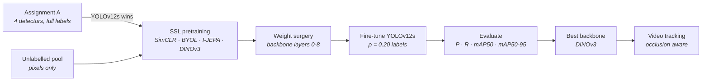
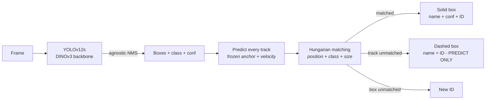

<div align="center">

# IoTKITs SSL Detection & Tracking

**Pretrain a YOLOv12s backbone without labels · Fine-tune it with 20% of the labels · Track IoT boards through occlusion**

[](https://www.python.org/)
[](https://pytorch.org/)
[](https://docs.ultralytics.com/)
[](https://docs.ultralytics.com/models/yolo12/)
[](https://www.kaggle.com/mrpaul0007/code)
[](LICENSE)

SimCLR · BYOL · I-JEPA · DINOv3 · ByteTrack + occlusion-aware identity manager

<br/>


<sub><b>Live tracking output.</b> DINOv3-initialised YOLOv12s + occlusion-aware identity manager.
Solid box = visible board · dashed box <code>ID n - PREDICT ONLY</code> = board hidden behind another,
drawn at its predicted position. Every board leaves the crossing with the ID and name it entered with.</sub>

</div>

---

> ### 🎓 New here? Start with the notebooks.
>
> You do **not** need a GPU or a local install. Every notebook runs in your browser on a free
> Kaggle **GPU T4** runtime.
>
> **1.** Open [NB-0 Partition](https://www.kaggle.com/code/mrpaul0007/self-supervised-learning-nb-0-partition) →
> **2.** Click **Copy & Edit** →
> **3.** Set **Accelerator → GPU T4**, turn **Internet on**, and run all cells.
>
> Then follow the [recommended run order](#assignment-b--ssl-pretraining-and-tracking).

---

## Contents

**Overview**
- [What this project does](#what-this-project-does)
- [Results at a glance](#results-at-a-glance)
- [Datasets](#datasets)

**Notebooks**
- [How to run a notebook on Kaggle](#how-to-run-a-notebook-on-kaggle)
- [Assignment A — detector selection](#assignment-a--detector-selection)
- [Assignment B — SSL pretraining and tracking](#assignment-b--ssl-pretraining-and-tracking)

**Reference**
- [SSL architectures](#ssl-architectures)
- [`.yaml` vs `.pt` — what our experiment claims](#yaml-vs-pt--what-our-experiment-claims)

**Guides**
- [1 · Partition the data](#1--partition-the-data)
- [2 · Pretrain without labels](#2--pretrain-without-labels)
- [3 · Transfer into a detector](#3--transfer-into-a-detector)
- [4 · Evaluate on labelled data](#4--evaluate-on-labelled-data)
- [5 · Track a video](#5--track-a-video)
- [Occlusion-aware identity manager](#occlusion-aware-identity-manager)

**Doing it properly**
- [Experimental protocol](#experimental-protocol)
- [Bugs found and fixed](#bugs-found-and-fixed)
- [Limitations](#limitations)
- [Repository layout](#repository-layout)
- [Team](#team)
- [License and acknowledgements](#license-and-acknowledgements)

---

## What this project does

Labelling detection data is expensive; unlabelled images are cheap. The project asks:

> **With only 20% of the labels, does self-supervised pretraining on the remaining images give a
> better detector than training from scratch — and does that detector track boards reliably in
> video?**



Built for **CSE445 Computer Vision** on Kaggle T4 runtimes, following the structure of the
course's SSL Detection Lab.

**Three things this project is careful about:**

| | |
|---|---|
| 🔍 **No hidden label use** | SSL pretraining reads pool images only. Validation and test images are verified absent from the pool in every notebook (5 × `PASS`). |
| ⚖️ **Fair comparison** | Every SSL method uses the same architecture, label subset, seed, image size, batch and epochs. Random-init and COCO baselines are trained **once** and reused by every notebook. |
| 📏 **Honest metric boundaries** | The tracking video has no ground-truth identities, so tracking is reported with proxy metrics and manual inspection — never as MOTA or IDF1. |

---

## Results at a glance

### Assignment A — which detector?


| Detector | mAP50 | mAP50-95 | Precision | Recall | F1 | FPS (T4) |
|---|---:|---:|---:|---:|---:|---:|
| YOLOv10s | 0.947 | 0.917 | 0.965 | 0.950 | 0.957 | **79.9** |
| **YOLOv12s** ✅ | **0.980** | **0.946** | **0.976** | **0.981** | **0.978** | 59.5 |
| YOLOv26s | 0.933 | 0.904 | 0.946 | 0.936 | 0.941 | 75.6 |
| RF-DETR-Nano | 0.851 | 0.829 | 0.656 | 0.911 | 0.745 | 35.4 |

<details>
<summary>Error analysis (test split)</summary>

| Detector | False negatives | False positives | Misclassified | Localization near-miss |
|---|---:|---:|---:|---:|
| YOLOv10s | 6 | 9 | 8 | 24 |
| **YOLOv12s** | **2** | 14 | **5** | **1** |
| YOLOv26s | 9 | 27 | 12 | 15 |
| RF-DETR-Nano | 4 | 179 | 50 | 0 |

- **YOLOv12s** had the fewest misses, fewest misclassifications and almost no localization errors.
- **RF-DETR-Nano** is NMS-free: several queries fire on one board with different look-alike
  classes, so recall stays high while precision collapses.
- Most confusions across all models are inside look-alike families — Pi Zero / Zero-W / Zero-WH /
  Zero-2-W and Arduino Nano / Micro.

</details>

**YOLOv12s was selected** — highest mAP50-95 and F1, at 59.5 FPS (still real-time).

### Assignment B — does SSL pretraining help with 20% of the labels?


YOLOv12s · ρ = 0.20 · seed 42 · 200 fine-tune epochs · **test split**

| Initialisation | Role | mAP50-95 | Δ vs random |
|---|---|---:|---:|
| COCO-pretrained | Supervised upper reference | 0.896 | +0.170 |
| 🥇 **DINOv3** | SSL (released weights + domain adaptation) | **0.743** | **+0.017** |
| SimCLR | SSL from scratch | 0.741 | +0.015 |
| I-JEPA | SSL from scratch | 0.733 | +0.007 |
| Random init | Lower reference | 0.726 | — |
| BYOL | SSL from scratch | 0.692 | −0.034 |

> **Why is COCO in the results?** The assignment requires two baselines run under the exact same
> fine-tuning settings: **random init** (the floor — "no pretraining at all") and
> **COCO-pretrained** (the ceiling — "pretraining *with* millions of labels"). An SSL number only
> means something between those two lines: random init tells you whether SSL helped at all, COCO
> tells you how much of the gap to supervised pretraining it closed. Here SSL closed about
> **10%** of that gap (+0.017 of +0.170). COCO is drawn as a reference line, not a competing bar,
> because it is not an SSL method.

> Three of four SSL methods beat random init, but the gaps (~0.01–0.02) are within single-seed
> noise. The honest reading: SSL on a few thousand unlabelled images helps a little; COCO-scale
> supervised pretraining still helps far more. BYOL's embeddings clustered by background and
> lighting rather than board type, which predicted its below-random result.

### Tracking

DINOv3 detector · 4 boards crossing in two rows · one board fully hidden at a time

| Board | ID before crossing | ID after crossing | Name kept |
|---|:---:|:---:|:---:|
| Arduino-Due | 1 | **1** | ✅ |
| Jetson Nano | 2 | **2** | ✅ |
| Raspberry-Pi-Zero-WH | 3 | **3** | ✅ |
| Arduino Uno (Black) | 4 | **4** | ✅ |

---

## Datasets

### 1 · IoTKITs — main dataset

| | |
|---|---|
| Source | [Mendeley Data · x5thzmkxhy/1](https://data.mendeley.com/datasets/x5thzmkxhy/1) |
| Content | RGB photographs of IoT development boards with bounding boxes |
| Format | `.jpg` / `.jpeg`, converted to YOLO labels |
| Classes | Arduino family (Due, Uno, Mega, Nano, Micro, ProMini, Leonardo, Zero, shields), Raspberry Pi family (1 / 2 / 3 / 4 / 5 / Zero / Zero-W / Zero-WH / Zero-2-W), ESP32, ESP8266, Wemos, STM32, Jetson Nano / TX2, TelosB |
| What makes it hard | Near-identical classes that differ only in small print, an antenna or a header row |

### 2 · Partitioned splits — derived from IoTKITs

Produced by [NB-0 Partition](https://www.kaggle.com/code/mrpaul0007/self-supervised-learning-nb-0-partition) and attached as a Kaggle
input to every Assignment B notebook.

```text
ssl_pool_images/      unlabelled pool used for SSL pretraining (labels discarded)
yolo_rho20/
├── images/train      ρ = 0.20 labelled subset, drawn from inside the pool
├── images/val        validation  (never in the pool)
├── images/test       test holdout (never in the pool)
└── data.yaml
```

### 3 · IoTKITs tracking video — built for this project

IoTKITs contains **no video**, so we built one.

| | |
|---|---|
| File | `IoTKITs.mp4` |
| How it was made | Composited in Canva from **real IoTKITs photographs taken from the val/test splits** — real camera pixels, not AI-generated |
| Resolution / FPS | 1920 × 1080 · 30 fps |
| Length | 24.2 s (727 frames); the first 20 s (600 frames) are tracked |
| Scene | 4 boards in two rows on a dark grid, sliding left ↔ right so that one board passes fully behind another |
| Ground truth | None — tracking is evaluated with proxy metrics |
| Kaggle | Published as a Kaggle dataset and attached to [NB-5 Tracking](https://www.kaggle.com/code/mrpaul0007/self-supervised-learning-nb-5-tracking) |

<details>
<summary>Why a composited video, and how it was designed</summary>

- **AI-generated video failed first.** An AI-generated clip gave 20–40% detection confidence and
  130+ track IDs for 10 boards — its rendering style was a domain shift from the studio
  photographs the detector learned from. Real dataset pixels raised confidence to 80–95%.
- **Board size matters.** At ~250 px width the details that separate look-alike classes vanished;
  ~350 px at 1920 width keeps them.
- **Controlled occlusion.** Two boards overlap at a time. Stacking three or four tests clutter,
  not occlusion.
- **Test-split images only**, so the detector is never tracking images it was trained on.

</details>

---

## How to run a notebook on Kaggle

1. Open the Kaggle link and click **Copy & Edit** (sign-in required).
2. Right sidebar → **Session options → Accelerator → GPU T4**.
3. Turn **Internet on** (needed for `pip install ultralytics` and YOLO configs).
4. **Add Input** → attach everything listed in the *Needs* column.
5. **Restart & Run All**.

> **Run pretraining before its detect partner.** A detect notebook reads the `*_backbone.pt`
> written by the matching pretrain notebook.
>
> **Edited a config value? Use Restart & Run All.** A quick save keeps the *old* outputs on
> screen, which looks like your change did nothing.

---

## Assignment A — detector selection

Full-label training of four detectors on the same leakage-safe split; the winner becomes the
Part B architecture. Local copies: [`Assignment A/`](Assignment%20A/).

| # | Notebook | What it does | Run on Kaggle |
|---:|---|---|---|
| 1 | **NB-1 · EDA + split** | Class distribution, image statistics, leakage-safe train / val / test split | [Open](https://www.kaggle.com/mrpaul0007/code) |
| 2 | **NB-2 · YOLOv10s** | Train, evaluate, per-example error analysis | [Open](https://www.kaggle.com/code/mrpaul0007/nb-2-yolov10) |
| 3 | **NB-3 · YOLOv12s** ✅ | Train, evaluate, error analysis — **selected detector** | [Open](https://www.kaggle.com/code/mrpaul0007/nb-3-yolov12) |
| 4 | **NB-4 · YOLOv26s** | Train, evaluate, error analysis, 3-way YOLO comparison | [Open](https://www.kaggle.com/code/mrpaul0007/nb-4-yolov26) |
| 5 | **NB-5 · RF-DETR-Nano** | Transformer detector, error analysis, final 4-way comparison | [Open](https://www.kaggle.com/code/mrpaul0007/nb-5-rf-detr) |

All YOLO notebooks use `SEED = 42`, `LRF = 0.01`, `COS_LR = False`. Each ends with a
per-example error analysis (false negatives, false positives, misclassifications, localization
near-misses) and a failure-pattern summary compared against the earlier models.

---

## Assignment B — SSL pretraining and tracking

Local copies: [`Assignment B/`](Assignment%20B/). Notebooks 1–2, 3–4, 5–6 and 7–8 are
**pretrain → detect pairs**; notebook 9 needs all four detect notebooks.

| # | Notebook | What it does | Needs | Run on Kaggle |
|---:|---|---|---|---|
| 0a | **Partition** | SSL pool / ρ = 0.20 / val / test, 5 leakage checks | IoTKITs | [Open](https://www.kaggle.com/code/mrpaul0007/self-supervised-learning-nb-0-partition) |
| 0b | **Baselines** | Random-init and COCO-pretrained YOLOv12s, trained once | 0a | [Open](https://www.kaggle.com/code/mrpaul0007/self-supervised-learning-nb-0-baseline) |
| 1 | **SimCLR pretraining** | NT-Xent, two-view demo, t-SNE, nearest neighbours | 0a | [Open](https://www.kaggle.com/code/mrpaul0007/self-supervised-learning-nb-1-simclr-pretrain) |
| 2 | **SimCLR → YOLOv12s** | Weight surgery, fine-tune, evaluate | 0a · 0b · 1 | [Open](https://www.kaggle.com/code/mrpaul0007/self-supervised-learning-nb-1-simclr-detect) |
| 3 | **BYOL pretraining** | Online / EMA target, AMP | 0a | [Open](https://www.kaggle.com/code/mrpaul0007/self-supervised-learning-nb-2-byol-pretrain) |
| 4 | **BYOL → YOLOv12s** | Weight surgery, fine-tune, evaluate | 0a · 0b · 3 | [Open](https://www.kaggle.com/code/mrpaul0007/self-supervised-learning-nb-2-byol-detect) |
| 5 | **I-JEPA pretraining** | ViT masked-latent prediction + CNN distillation | 0a | [Open](https://www.kaggle.com/code/mrpaul0007/self-supervised-learning-nb-3-ijepa-pretrain) |
| 6 | **I-JEPA → YOLOv12s** | Weight surgery, fine-tune, evaluate | 0a · 0b · 5 | [Open](https://www.kaggle.com/code/mrpaul0007/self-supervised-learning-nb-3-ijepa-detect) |
| 7 | **DINOv3 pretraining** | Domain-adaptive multi-crop + CNN distillation | 0a | [Open](https://www.kaggle.com/code/mrpaul0007/self-supervised-learning-nb-3-dinov3-pretrain) |
| 8 | **DINOv3 → YOLOv12s** | Weight surgery, fine-tune, evaluate | 0a · 0b · 7 | [Open](https://www.kaggle.com/code/mrpaul0007/self-supervised-learning-nb-4-dinov3-detect) |
| 9 | **Tracking** | Re-score all four, export winner, detect + track the video | 0a · 2 · 4 · 6 · 8 · video | [Open](https://www.kaggle.com/code/mrpaul0007/self-supervised-learning-nb-5-tracking) |

<details>
<summary>Shared notebook layout</summary>

All pretrain notebooks share one cell layout and all detect notebooks share another, so the four
methods read as one consistent study.

```text
Pretrain:  Config → Subset verification → Model + loss → Augmentation / masking + dataset
           → Sanity-check demo → Train → Loss curve → t-SNE + top-5 nearest neighbours
           → Interpretation → (ViT methods: CNN distillation + collapse check) → Save backbone

Detect:    Config → Data YAML → Subset verification → Weight surgery → Fine-tune
           → Demo inference → Baselines (reused) → Evaluation (val + test)
           → Qualitative predictions → Save results CSV
```

</details>

<details>
<summary>Measured T4 runtime</summary>

| Notebook | Time |
|---|---|
| I-JEPA pretraining (ViT 200 epochs ≈ 318 min + distillation 200 epochs ≈ 38 min) | ~6 h |
| DINOv3 pretraining (200 epochs ≈ 335 min + distillation 200 epochs ≈ 42 min) | ~6.3 h |

</details>

---

## SSL architectures

| Architecture | Type | Objective | Encoder | Start weights | Moving target |
|---|---|---|---|---|---|
| **SimCLR** | Contrastive | NT-Xent agreement between 2 augmented views | YOLOv12s backbone | Random | No |
| **BYOL** | Non-contrastive | Online predictor matches EMA target projection | YOLOv12s backbone | Random | EMA |
| **I-JEPA** | Predictive | Predict target-block latents from a context block | ViT → distilled into YOLOv12s | Random | EMA |
| **DINOv3** | Self-distillation | Multi-crop student/teacher with centering | ViT-S/16 → distilled into YOLOv12s | Released DINOv3 weights | EMA |

> The assignment allows **only DINOv3** to start from released pretrained weights
> (domain-adaptive continuation). SimCLR, BYOL and I-JEPA run their objective from random
> initialisation.

### `.yaml` vs `.pt` — what our experiment claims

| File | Initialisation | Used for |
|---|---|---|
| `yolo12s.yaml` | Random | SSL pretraining and the random baseline — **strict label-free** claim |
| `yolo12s.pt` | COCO-supervised | COCO baseline only — never reported as label-free |

> **No `v` from YOLO11 onward.** `YOLO("yolo12s.yaml")` ✅ — `YOLO("yolov12s.yaml")` ❌ does not
> exist upstream.

---

## 1 · Partition the data

```python
SEED = 42
RHO  = 0.20
```

```text
Disjointness checks
  train  subset-of ssl_pool         0   PASS
  test   ∩ ssl_pool                 0   PASS
  val    ∩ ssl_pool                 0   PASS
  test   ∩ train                    0   PASS
  val    ∩ train                    0   PASS
```

The labelled subset is drawn **from inside** the SSL pool, so pretraining never sees a validation
or test image.

---

## 2 · Pretrain without labels

```python
METHOD    = "SimCLR"            # or BYOL / I-JEPA / DINOv3
BEST_YAML = "yolo12s.yaml"      # random init
IMGSZ_SSL = 224
BATCH     = 16
EPOCHS    = 200
```

```python
full = YOLO(BEST_YAML).model
n_bb = len(full.yaml["backbone"])                 # 9 backbone layers
backbone = nn.Sequential(*list(full.model[:n_bb]))
# ... train the SSL objective on backbone ...
torch.save(backbone.state_dict(), "simclr_backbone.pt")
```

<details>
<summary>Representation diagnostics produced by every pretrain notebook</summary>

- Loss curve
- Two augmented views (or context/target masks) of one image, shown **before** training
- t-SNE of validation embeddings
- Top-5 nearest-neighbour retrieval
- A written interpretation — e.g. BYOL's neighbours matched background and lighting rather than
  board type, which predicted its weak downstream score

</details>

<details>
<summary>Why I-JEPA and DINOv3 need a distillation phase</summary>

Both learn a **ViT**, but YOLOv12s needs a **CNN** backbone. A second phase freezes the ViT and
trains a fresh YOLOv12s backbone + projector to match its pooled features:

```text
loss = −cosine(cnn_feat, vit_feat) + 5 · variance_loss + 1 · covariance_loss
```

The variance/covariance terms stop the CNN collapsing to a constant output. A reload check then
confirms `missing: 0, unexpected: 0` against `yolo12s.yaml`.

</details>

### Outputs

```text
simclr_backbone.pt   byol_backbone.pt   ijepa_backbone.pt   dinov3_backbone.pt
*_loss_curve.png     *_tsne.png         *_retrieval_panel.png
```

---

## 3 · Transfer into a detector

```python
det = YOLO("yolo12s.yaml")
model_sd = det.model.state_dict()
ssl_sd = torch.load(SSL_CKPT, map_location="cpu")

loaded = {"model." + k: v for k, v in ssl_sd.items()
          if "model." + k in model_sd and model_sd["model." + k].shape == v.shape}
model_sd.update(loaded)
det.model.load_state_dict(model_sd)
```

Verified for all four methods:

```text
Tensors initialised from SSL   : 342 / 691
Shape-mismatch / unused        : 0
SSL-initialised layer indices  : [0, 1, 2, 3, 4, 5, 6, 7, 8]      ← backbone
Randomly-initialised layers    : [11, 14, 15, 17, 18, 20, 21]     ← neck + head
>>> backbone == SSL ckpt: True                                      ← checked at train start
```

Then ordinary Ultralytics fine-tuning:

```python
det.train(data=DATA_YAML, epochs=200, imgsz=640, batch=16,
          optimizer="auto", lr0=0.01, lrf=0.01, seed=42)
```

---

## 4 · Evaluate on labelled data

```python
r = YOLO(best_pt).val(data=DATA_YAML, split="test", imgsz=640,
                      conf=0.001, iou=0.70, batch=16)
print(r.box.mp, r.box.mr, r.box.map50, r.box.map)
```

> **Evaluate at the resolution you trained at.** Re-scoring the same checkpoints at
> `imgsz=1280, iou=0.45` dropped every method to mAP ≈ 0.07–0.10 and picked the wrong winner.
> At `imgsz=640, iou=0.70` the numbers match each detect notebook exactly.

| Output | Contents |
|---|---|
| `<method>_result.csv` | P, R, mAP50, mAP50-95 for SSL / random / COCO on test |
| `ssl_ranking_rho20.csv` | All four SSL methods ranked |
| `*_test_eval/` | PR curve, confusion matrix, predictions |

---

## 5 · Track a video

The video is described under [Datasets → 3](#3--iotkits-tracking-video--built-for-this-project).

### Tracking settings

| Setting | Value | Why |
|---|---|---|
| Checkpoint re-scoring | `imgsz=640`, `iou=0.70` | Must match how the checkpoints were trained and evaluated |
| Video `imgsz` | 1920 | Native video width; keeps small details |
| `conf` / `iou` | 0.30 / 0.45 | Video detection thresholds |
| `agnostic_nms` | `True` | One box per board even when two similar classes fire |
| `tracker` | `bytetrack.yaml` | Raw IDs are logged; final IDs come from the identity manager |
| `KEEP_LOST_FRAMES` | 200 | A hidden board is remembered for ~6.7 s |

### Outputs

```text
group-k_partB_tracked_h264.mp4   annotated video
tracks.csv                       frame, track_id, box, conf, class, tracker_raw_id
tracks_mot.txt                   MOT-format tracks
ssl_ranking_rho20.csv            all four SSL backbones re-scored on test
proxy_metrics.json               unique IDs, track length, fragmentation, FPS
video_doc.json                   source, trim, resolution, frame rate
```

> ### A plain video has no ground truth
>
> **Measurable here:** unique track IDs vs expected board count · track length ·
> fragmentation · detection confidence · inference and end-to-end FPS · manual ID-switch notes.
>
> **Not calculable:** MOTA · MOTP · IDF1 · HOTA — these need ground-truth identities per frame.

---

## Occlusion-aware identity manager

Plain ByteTrack kept giving hidden boards a new ID. We traced the failure to five causes and
replaced ByteTrack's ID decision with a small matcher on top of the detector.



| Symptom in the video | Root cause | Fix |
|---|---|---|
| Hidden board returns with a **new ID** | Memory (8 → 90 frames) shorter than the occlusion (~95 frames at ~2 px/frame) | `KEEP_LOST_FRAMES = 200` |
| Predicted box drifts the **wrong way** | While half-covered, the box shrinks from one side, so its centre moves opposite to the real motion | Update position/velocity **only from full-size boxes** (≥ 95%), freeze while occluded |
| **Two IDs on one board** | Model fires two similar classes (*Uno Black* / *Uno Camera Shield*); class-wise NMS keeps both | `agnostic_nms=True` |
| ByteTrack **swaps IDs** at the crossing | ByteTrack matches by box overlap; crossing boards overlap | Ignore ByteTrack IDs; Hungarian matching on our own cost |
| Top board takes the hidden board's ID | Both tracks predicted at the same spot → tie | Class penalty for confident mismatches + size tie-break |
| Name flickers during overlap | Partly visible boards get misclassified | Name = confidence-weighted vote over **full-view** frames only |

<details>
<summary>Matching cost</summary>

```python
def assign_cost(track, frame, det):
    px, py = predict_center(track, frame)          # anchor + velocity × gap
    # how far the box sticks out of the track's predicted full box
    # (a partly visible box lying inside it costs ~0)
    ox = max(0, abs(det.cx - px) - max(0, (track.full_w - det.w) / 2))
    oy = max(0, abs(det.cy - py) - max(0, (track.full_h - det.h) / 2))
    cost = ox + oy
    cost += SIZE_PENALTY * size_mismatch(det, track)            # 40
    if det.conf >= 0.6 and det.cls != track.locked_cls:
        cost += CLASS_PENALTY                                    # 120
    return cost                                                  # match if ≤ 150
```

| Parameter | Value |
|---|---|
| `FULL_RATIO` | 0.95 |
| `ASSIGN_GATE` | 150 px |
| `CLASS_PENALTY` | 120 |
| `SIZE_PENALTY` | 40 |
| `MIN_GHOST_LEN` | 15 full-view frames before a track may be drawn as PREDICT ONLY |

</details>

> The identity manager improves **association**, not **detection**. If the detector names a board
> wrongly in every full view, the locked name is consistently wrong. Detector accuracy (~0.74
> mAP50-95) remains the ceiling.

---

## Experimental protocol

| Setting | Value |
|---|---|
| Architecture | `yolo12s.yaml` |
| Label fraction ρ | 0.20 |
| Seed | 42 |
| SSL image size / batch / epochs | 224 / 16 / 200 |
| Fine-tune image size / batch / epochs | 640 / 16 / 200 |
| Optimizer, `lr0`, `lrf` | `auto`, 0.01, 0.01 |
| Eval `conf` / `iou` | 0.001 / 0.70 |
| Hardware | Kaggle T4 |

> **Epoch budget.** The assignment's standard fine-tune budget is 50 epochs; we used 200 because
> the T4 session allowed it, applied identically to every condition.

| # | Condition | Initialisation |
|---:|---|---|
| 1 | Baseline | Random YOLOv12s |
| 2 | Supervised transfer | COCO-pretrained YOLOv12s |
| 3 | Strict SSL | SimCLR / BYOL / I-JEPA from `yolo12s.yaml` |
| 4 | Warm-start SSL | DINOv3 from released weights, then domain adaptation |

---

## Bugs found and fixed

Kept on purpose — every one of these changed the results.

<details>
<summary>Expand the full list</summary>

| Bug | Symptom | Fix |
|---|---|---|
| Detect notebooks used `yolov10m.yaml` while SSL used YOLOv12s | Weight surgery "matched" by coincidence; SimCLR scored **below random** | `yolo12s.yaml` everywhere |
| Baselines retrained inside each detect notebook | Two conflicting sets of baseline numbers | Reuse `nb-0-baseline` |
| BYOL checkpoint keys prefixed `backbone.` | Did not load in weight surgery | Save `online_enc.state_dict()` (flat keys) |
| I-JEPA / DINOv3 produced ViT weights | Not loadable into a CNN detector | Added CNN distillation phase |
| DINOv3 pretrain missing `ultralytics` | `ModuleNotFoundError` at distillation | `pip install ultralytics timm` |
| Tracking re-scored checkpoints at `imgsz=1280, iou=0.45` | mAP ≈ 0.07–0.10, **wrong winner** | Re-score at `640 / 0.70` |
| BoT-SORT with generic person Re-ID | 2,000+ IDs | Dropped Re-ID |
| BoT-SORT yaml missing `model` key | `AttributeError` | `model: auto` |
| Occlusion handling | ID changes after every crossing | [Identity manager](#occlusion-aware-identity-manager) |

</details>

---

## Limitations

- **One seed, one ρ.** DINOv3 / SimCLR / I-JEPA differ by ~0.01 mAP — within run-to-run noise. Three
  seeds with mean ± std would be needed to claim a ranking.
- **Detection caps tracking.** Look-alike classes (Pi Zero family, Arduino Nano/Micro) are still
  confused at ~0.74 mAP50-95.
- **No tracking ground truth.** Proxy metrics and manual inspection only.
- **Constant-velocity assumption.** The identity manager suits smooth motion; sharp turns or camera
  shake would need a stronger motion model.
- **Composited video.** Real dataset pixels on a synthetic layout — real camera footage may behave
  differently.

---

## Repository layout

All training ran on **Kaggle**. This repository holds the exported notebooks; datasets, checkpoints and full outputs live in each notebook's **Kaggle Output** tab.

```text
├── Assignment A/      NB-1 … NB-5 — EDA, YOLOv10s, YOLOv12s, YOLOv26s, RF-DETR-Nano
├── Assignment B/      partition, baselines, 4 × (pretrain + detect), tracking
├── LICENSE            Apache-2.0
└── README.md
```

<details>
<summary>Where each Kaggle output lives</summary>

| Output | Produced by |
|---|---|
| `yolo_rho20/`, `ssl_pool_images/` | Partition |
| `base_random/`, `base_coco/` | Baselines |
| `*_backbone.pt` | Pretrain notebooks |
| `*_rho20/weights/best.pt`, `*_result.csv` | Detect notebooks |
| Tracked video, `tracks.csv`, `tracks_mot.txt`, `ssl_ranking_rho20.csv`, `proxy_metrics.json` | Tracking |

To run from this repo: download a notebook → Kaggle **New Notebook → File → Import Notebook** →
attach its inputs → **Run All**.

</details>

---

## Team

**CSE445 Computer Vision · Assignment 2 · Group K · East West University**

| Name | ID |
|---|---|
| Ani Paul | 2022-3-60-321 |
| Srabusty Nasrin Sojja | 2022-3-60-309 |
| Khaled Mahmood Sifat | 2022-3-60-217 |

---

## License and acknowledgements

The notebooks in this repository are released under **Apache-2.0** — see [`LICENSE`](LICENSE).
Dependencies, weights and data keep their own terms.

| Component | Terms |
|---|---|
| **Ultralytics** | AGPL-3.0 for open-source use, or an [Enterprise License](https://www.ultralytics.com/license) |
| **DINOv3** | Meta's [DINOv3 License](https://github.com/facebookresearch/dinov3/blob/main/LICENSE.md) |
| **IoTKITs** | Terms on the [Mendeley Data page](https://data.mendeley.com/datasets/x5thzmkxhy/1) |

**References** — SimCLR (Chen et al., 2020) · BYOL (Grill et al., 2020) · I-JEPA (Assran et al.,
2023) · DINOv3 (Meta AI) · YOLO12 and ByteTrack via Ultralytics · RF-DETR (Roboflow).
Structure and workflow follow the course instructor's
[SSL Detection Lab](https://github.com/rifat963/ssl-detection-lab).

<div align="center">

---

**[Demo](#iotkits-ssl-detection--tracking) · [Results](#results-at-a-glance) · [Datasets](#datasets) · [Assignment A](#assignment-a--detector-selection) · [Assignment B](#assignment-b--ssl-pretraining-and-tracking) · [Identity manager](#occlusion-aware-identity-manager)**

</div>

https://github.com/user-attachments/assets/a1e2c774-e390-4459-a9fa-5a7ca5687759


